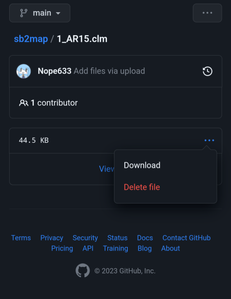

# SimpleSandBox2の配布マップの規約と導入,配布方法について
導入方法や規約が記載してありますので**必ず**ご一読ください。

・SimpleSandBox2配布ワールドの利用規約について 2023/06/10改訂版

この利用規約（以下「本規約」といいます）は、配布ワールドを利用するすべてのユーザー（以下「ユーザー」といいます）に適用されます。配布ワールドの利用には、本規約の全文への同意が必要です。配布ワールドの利用を開始する前に、以下の内容をよくお読みください。また、**配布品をダウンロードした時点で**、規約に同意したものとみなします。  
**最低でも利用制限だけはご一読お願いいたします**

・著作権および知的財産権

(a)配布ワールドの著作権および知的財産権はワールド作成者に帰属します。  
(b)著作権や知的財産権を尊重して利用してください。

・利用制限

(a)配布ワールドの商業利用や営利目的での利用は禁止です。  
(b)配布ワールドの無改変や改変後の再配布も禁止です。  
(c)配布ワールドを不正利用したり違法行為に利用したりしないでください。  
(d) 配布ワールドに関する虚偽の情報の提供はしないでください  
(e) 配布ワールドの著作権や知的財産権の侵害行為は禁止です。 

・免責事項

(a)配布ワールドは現状のまま提供されます。作成者は利用による損害について責任を負いません。

・その他の規約

(a)本規約は変更される場合があります。変更は当サイトを通じて通知されます。
(b)規約を順守されてなかったりした場合などは配布を停止する可能性もあります。

・配布マップのデータについて  

[1_AR15.clm](https://github.com/Nope633/sb2map/blob/main/1_AR15.clm) AR-15を信仰する人たちの教会と、基地やコンビニがある配布マップです。  
[2_school.clm](https://github.com/Nope633/sb2map/blob/main/2_school.clm) 学校と[鉤十字](https://ja.wikipedia.org/wiki/%E3%83%8F%E3%83%BC%E3%82%B1%E3%83%B3%E3%82%AF%E3%83%AD%E3%82%A4%E3%83%84)がある配布マップです。  
[3_desert.clm](https://github.com/Nope633/sb2map/blob/main/3_desert.clm) 初代SimpleSandboxの砂漠マップを再現した配布マップです。ゴミがあるので使う際にはそれを片付けてから使うことをお勧めします。  
[4_bar.clm](https://github.com/Nope633/sb2map/blob/main/4_bar.clm) 文字通りバーがある配布マップです二階にはマフィアの拠点があります。  
[5_heavn.clm](https://github.com/Nope633/sb2map/blob/main/5_heavn.clm) "アビス"を目指す人たちの町の配布マップです。  
[6_city.clm](https://github.com/Nope633/sb2map/blob/main/6_city.clm) 裏路地にひっそりとある[反乱派](https://ja.wikipedia.org/wiki/%E3%82%A2%E3%82%A4%E3%83%AB%E3%83%A9%E3%83%B3%E3%83%89%E5%85%B1%E5%92%8C%E8%BB%8D)の拠点がある配布マップです。  
[7_smovie theatre.clm](https://github.com/Nope633/sb2map/blob/main/7_smovie%20theatre.clm) もとからある映画館のマップです。 

・導入方法について

必要なもの  
SimpleSandBox2  
[ファイルマネージャー](https://play.google.com/store/apps/details?id=com.alphainventor.filemanager) 

1.まずView Codeを押して、ファイルを表示します。そこでお好きなマップファイルをタップし画面右にある"・・・"を押してDownloadを押します。

 
  
2.DLが終わりましたらファイルマネージャーでダウンロードの欄から先ほどDLされたファイルを移動かコピーを押して左上の三本線を押して、メインストレージを押します。   
3.そうしましたら、メインストレージ/Android/data/com.SimpleSandbox2/files/SaveMapに行き、貼り付けます。これで導入は完了です。

備考  
SImpleSandbox2でセーブした名前と同じファイルをそこから探して、導入方法の逆でお好きなドライブに保存すれば終わるので省かせていただきます。 
当サイトに乗っけたい場合はDiscordの"HSI姉貴#4388"のDMまでご連絡下さい

